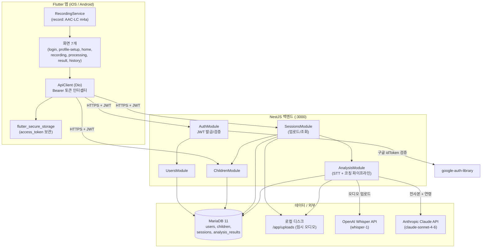
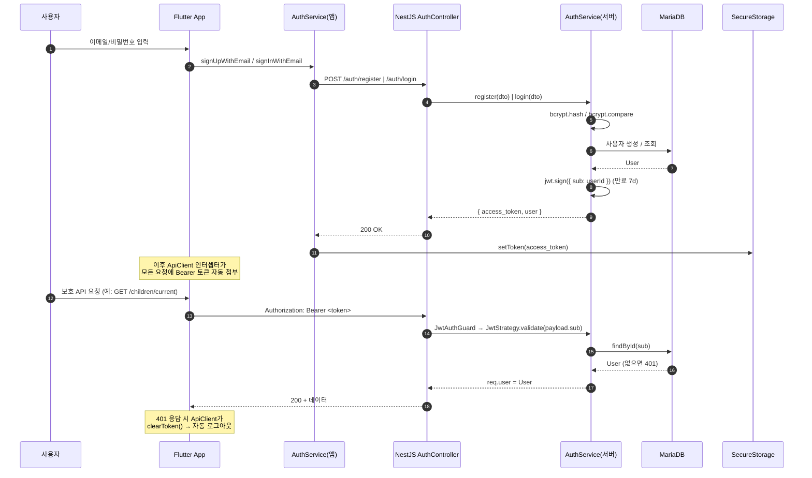
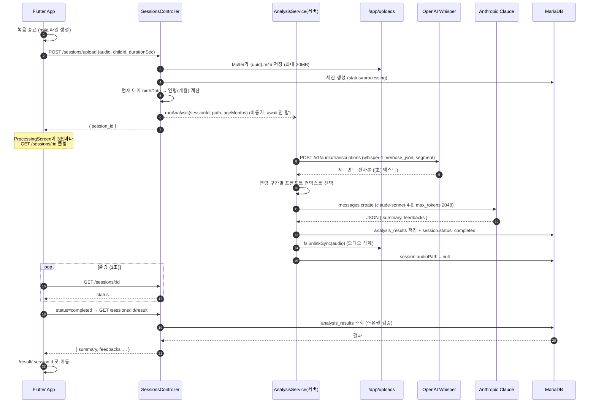
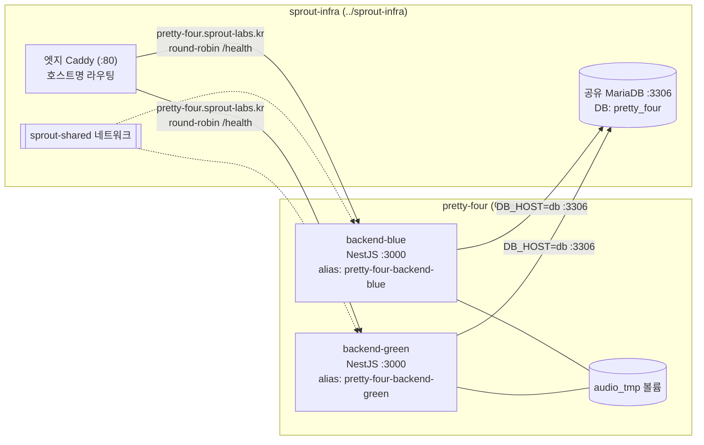

# 아이 훈육 코칭 앱 — 고수준 설계 문서 (HLD)

## 1. 문서 정보

| 항목 | 내용 |
|------|------|
| 제목 | 아이 훈육 코칭 앱 High-Level Design (HLD) |
| 버전 | 1.0 |
| 작성일 | 2026-05-30 |
| 상태 | 초안 (Draft) |
| 대상 시스템 | Flutter 모바일 클라이언트 + NestJS 백엔드 (MVP) |

> 본 문서는 실제 코드베이스(`backend/`, `pretty_four/`, `docker-compose.yml`)를 기준으로 작성되었다. 기존 설계 스펙(`docs/superpowers/specs/2026-05-30-child-coaching-design.md`)은 Supabase 기반 구조를 가정했으나, **현재 구현은 NestJS + MariaDB + Docker Compose 자체 백엔드**로 변경되었으며 본 HLD는 구현 코드를 정본(source of truth)으로 삼는다.

---

## 2. 시스템 개요

### 2.1 목적
부모가 아이와의 일상 대화를 모바일 앱으로 녹음하면, AI가 음성을 텍스트로 전사하고 발달심리학 기반으로 분석하여 **연령별 맞춤 훈육 코칭**을 제공한다.

### 2.2 핵심 가치
- **원스톱 흐름**: 녹음 → 전사 → 분석 → 코칭 결과까지 앱 하나로 완결.
- **연령 맞춤 피드백**: 아이의 나이(개월 수)를 4개 구간으로 나눠 코칭 방향을 차등 적용.
- **개인정보 보호 우선**: 업로드된 오디오 파일은 분석 완료(또는 실패) 직후 서버에서 즉시 삭제되며, DB의 `audioPath`도 null로 초기화된다.

### 2.3 대상 사용자
- 만 2세 ~ 11세 이상 자녀를 둔 부모.
- 자녀와의 대화 방식을 개선하고 싶은 양육자.

---

## 3. 전체 아키텍처

### 3.1 구성요소 역할

| 구성요소 | 역할 |
|----------|------|
| **Flutter 앱** | 사용자 인터페이스, 마이크 녹음(AAC-LC m4a), 토큰 보관, API 호출 및 결과 폴링. |
| **ApiClient (Dio)** | 모든 요청에 `Authorization: Bearer <token>` 자동 첨부. 401 응답 시 토큰 자동 삭제(로그아웃). connectTimeout 30초 / receiveTimeout 60초. |
| **AuthModule** | 이메일·구글·카카오 인증 처리, JWT 발급(`sub`=userId), Passport JWT 전략으로 보호 API 검증. |
| **UsersModule** | 사용자 CRUD, 이메일/소셜 ID 조회. `password`는 기본 select 제외 컬럼. |
| **ChildrenModule** | 아이 프로필 등록/조회/수정. 사용자당 "현재 아이" 1명 조회 지원. |
| **SessionsModule** | 오디오 업로드 수신(Multer disk storage), 세션 레코드 생성, 분석 트리거(fire-and-forget), 세션/결과 조회. |
| **AnalysisModule** | Whisper 전사 → Claude 분석 → DB 저장 → 오디오 삭제의 백그라운드 파이프라인. 연령 구간별 프롬프트 컨텍스트 적용. |
| **MariaDB 11** | TypeORM(`synchronize: NODE_ENV!=='production'`일 때만 true; production에서는 false + `migrationsRun:true`, `utf8mb4`)로 4개 엔티티 영속화. 공유 인프라(sprout-infra) MariaDB 사용. |
| **OpenAI Whisper / Anthropic Claude** | 외부 AI 서비스. 서버가 API 키를 보관하고 서버-사이드에서만 호출. |

> 참고: 구글 로그인 검증은 `google-auth-library`의 `OAuth2Client.verifyIdToken`으로 수행되며, 카카오는 `https://kapi.kakao.com/v2/user/me` 호출로 검증한다.

---

## 4. 기술 스택

### 4.1 클라이언트 (Flutter — `pretty_four/pubspec.yaml`)

| 영역 | 패키지 / 버전 |
|------|----------------|
| 프레임워크 | Flutter (Dart SDK ^3.9.0) |
| HTTP 클라이언트 | dio ^5.4.0 |
| 토큰 보관 | flutter_secure_storage ^9.2.2 |
| 라우팅 | go_router ^13.2.0 |
| 상태관리 | flutter_riverpod ^2.5.1, riverpod_annotation ^2.3.5 |
| 녹음 | record ^6.2.1 |
| 권한 | permission_handler ^11.3.1 |
| 파일 경로 | path_provider ^2.1.3 |
| 소셜 로그인 | google_sign_in ^6.2.1, kakao_flutter_sdk_user ^1.9.5 |
| 환경변수 | flutter_dotenv ^5.1.0 |
| 기타 | uuid ^4.4.0, intl ^0.19.0 |

### 4.2 백엔드 (NestJS — `backend/package.json`)

| 영역 | 패키지 / 버전 |
|------|----------------|
| 프레임워크 | @nestjs/common·core·platform-express ^10.0.0 |
| 설정 | @nestjs/config ^3.2.0 |
| ORM | @nestjs/typeorm ^10.0.0, typeorm ^0.3.20, mysql2 ^3.9.0 |
| 인증 | @nestjs/jwt ^10.2.0, @nestjs/passport ^10.0.0, passport ^0.7.0, passport-jwt ^4.0.1 |
| 비밀번호 해싱 | bcrypt ^5.1.1 |
| 검증 | class-validator ^0.14.1, class-transformer ^0.5.1 |
| 파일 업로드 | multer ^1.4.5-lts.1 |
| HTTP / 외부 API | axios ^1.6.8, form-data ^4.0.0 |
| AI SDK | @anthropic-ai/sdk ^0.24.0 (Whisper는 axios로 직접 호출) |
| 소셜 검증 | google-auth-library ^9.7.0 |

### 4.3 인프라

| 영역 | 기술 |
|------|------|
| DB | MariaDB 11 (Docker 이미지 `mariadb:11`) |
| 오케스트레이션 | Docker Compose 3.8 |
| 런타임 | Node.js (백엔드 컨테이너), 포트 3000 |

---

## 5. 주요 기능 (유스케이스)

| # | 기능 | 클라이언트 화면/서비스 | 백엔드 엔드포인트 |
|---|------|------------------------|-------------------|
| UC-1 | **회원가입/로그인 (이메일)** | LoginScreen / AuthService | `POST /auth/register`, `POST /auth/login` |
| UC-2 | **소셜 로그인 (구글/카카오)** | LoginScreen / AuthService | `POST /auth/google/token`, `POST /auth/kakao` |
| UC-3 | **아이 프로필 등록/조회/수정** | ProfileSetupScreen / ChildService | `POST /children`, `GET /children/current`, `PATCH /children/:id` |
| UC-4 | **대화 녹음** | RecordingScreen / RecordingService | (로컬) AAC-LC, 44.1kHz, 모노 m4a |
| UC-5 | **오디오 업로드 + 분석 트리거** | ProcessingScreen / AnalysisService | `POST /sessions/upload` (multipart, 최대 30MB) |
| UC-6 | **분석 진행 폴링** | ProcessingScreen | `GET /sessions/:id` (3초 주기) |
| UC-7 | **결과 조회** | ResultScreen / AnalysisService | `GET /sessions/:id/result` |
| UC-8 | **히스토리(완료 세션 목록)** | HistoryScreen·HomeScreen / SessionService | `GET /sessions?limit=` |

라우트는 go_router 기준 총 7개: `/login`, `/profile-setup`, `/home`, `/recording`, `/processing/:sessionId`, `/result/:sessionId`, `/history`. 인증 상태에 따라 `redirect`에서 로그인/프로필 설정/홈으로 자동 분기한다.

### 5.1 데이터 모델 (TypeORM 엔티티)

| 엔티티 | 주요 컬럼 |
|--------|-----------|
| `users` | id(uuid PK), email(unique, nullable), password(select:false), provider(email\|google\|kakao), providerId, createdAt |
| `children` | id(uuid PK), userId(FK), name, birthDate(date), createdAt |
| `sessions` | id(uuid PK), childId(FK), userId, audioPath(nullable), durationSec, status(processing\|completed\|failed), recordedAt |
| `analysis_results` | id(uuid PK), sessionId(OneToOne), summary(json), feedbacks(json), rawTranscript(text), childAgeMonths, createdAt |

---

## 6. 핵심 데이터 흐름

### 6.1 인증 흐름 (회원가입/로그인 → JWT 발급 → 보호 API 호출)

소셜 로그인(UC-2)은 앱이 구글 `idToken` 또는 카카오 `accessToken`을 받아 각각 `POST /auth/google/token`·`POST /auth/kakao`로 전달하고, 서버가 해당 토큰을 외부 검증한 뒤 동일하게 자체 JWT를 발급한다.

### 6.2 녹음 → 분석 → 결과 흐름

실패 시(`status=failed`)에는 분석 파이프라인의 `finally` 블록에서 동일하게 오디오를 삭제하고, 앱은 폴링 중 실패를 감지하면 안내 후 홈으로 복귀한다.

**연령 구간별 코칭 컨텍스트** (`AnalysisService`의 `getAgeContext`):

| 개월 수 | 구간 | 코칭 방향 |
|---------|------|-----------|
| < 48 (만 2~3세) | infant | 단순·일관된 지시, 짧은 문장, 감정 이름 붙이기 |
| 48~83 (만 4~6세) | preschool | 선택지 제공, 규칙 이유 설명, 긍정 강화 |
| 84~131 (만 7~10세) | school | 논리적 설명, 감정 공감 우선, 질문 유도 |
| ≥ 132 (만 11세+) | preteen | 자율성 존중, 협상·타협 |

---

## 7. 배포 아키텍처

**인프라 분리 원칙:** DB(MariaDB)와 엣지 리버스 프록시(Caddy)는 공유 인프라 `../sprout-infra`가 소유한다.
이 repo는 `backend-blue/green`만 띄우고 외부 네트워크 `sprout-shared`에 alias로 노출한다.

| 서비스 | 이미지/빌드 | 포트(호스트) | 볼륨 | 비고 |
|--------|-------------|------|------|------|
| **backend-blue** | `./backend/Dockerfile` 빌드 | 미노출(네트워크 alias) | `audio_tmp → /app/uploads` | `sprout-shared` external network, alias `pretty-four-backend-blue` |
| **backend-green** | `pretty-four-backend:latest` 이미지 재사용 | 미노출(네트워크 alias) | `audio_tmp → /app/uploads` | `sprout-shared` external network, alias `pretty-four-backend-green` |
| **db** (공유) | `mariadb:11` — sprout-infra 소유 | sprout-infra 관리 | sprout-infra 관리 | DB_NAME=pretty_four, DB_USER=pretty_four |
| **엣지 Caddy** (공유) | sprout-infra 소유 | :80 (sprout-infra) | — | `caddy/sites/pretty-four.caddy` 라우팅 |

- 환경변수: DB 접속 정보(`DB_*`), `JWT_SECRET`/`JWT_EXPIRES_IN`(기본 7d), `OPENAI_API_KEY`, `ANTHROPIC_API_KEY`, `GOOGLE_CLIENT_ID`, `UPLOAD_DIR`(기본 `/app/uploads`)는 백엔드 `.env`에 보관.
- TypeORM `synchronize`: `NODE_ENV !== 'production'`일 때만 `true`(개발). 운영(`NODE_ENV=production`)에서는 `false` + `migrationsRun:true`(부팅 시 마이그레이션 자동 적용).
- 앱은 `flutter_dotenv`로 `API_BASE_URL`, `KAKAO_NATIVE_APP_KEY`를 로드한다.
- 사전 조건: `(cd ../sprout-infra && docker compose up -d)` — DB·네트워크·엣지 Caddy는 sprout-infra 소유.

---

## 8. 보안 설계

| 영역 | 설계 |
|------|------|
| **인증** | JWT 기반. 페이로드는 `{ sub: userId }`, 만료 기본 7일. 모든 보호 컨트롤러는 `@UseGuards(JwtAuthGuard)` + Passport JWT 전략으로 검증하며, 토큰의 `sub`로 실제 사용자 존재를 DB 재확인. |
| **비밀번호** | 이메일 가입 시 `bcrypt.hash(password, 10)`로 해싱 저장. 로그인은 `bcrypt.compare`. `password` 컬럼은 엔티티에서 `select: false`로 기본 응답에서 제외. |
| **사용자별 데이터 격리** | children/sessions/analysis 조회는 `req.user.id` 기준으로 필터링. 세션 단건/결과 조회 시 `session.userId !== userId`면 `ForbiddenException`. |
| **API 키 보관** | OpenAI·Anthropic·Google Client ID는 서버 `.env`에만 존재하며, 외부 AI 호출은 전적으로 서버-사이드에서 수행 (클라이언트에 키 노출 없음). |
| **오디오 즉시 삭제** | 분석 성공/실패와 무관하게 `finally`에서 `fs.unlinkSync`로 디스크 파일 삭제 + `session.audioPath = null`. 원본 음성은 영구 저장하지 않음(전사본 텍스트만 `rawTranscript`로 보관). |
| **토큰 보관(클라이언트)** | `flutter_secure_storage`(OS 키체인/키스토어)에 access_token 저장. 401 응답 시 자동 폐기. |
| **전송 보안** | 운영 환경에서는 HTTPS 종단 전제. (현재 `enableCors({ origin: '*' })`는 개발 설정이며 운영 시 출처 제한 필요.) |

---

## 9. 비기능 요구사항 (NFR)

| 구분 | 요구사항 / 기준 |
|------|-----------------|
| **성능** | 5분 녹음 기준 전사+분석 총 처리 시간 목표 약 20~40초. 클라이언트는 3초 주기 폴링으로 완료 감지. 업로드 파일 상한 30MB. |
| **확장성** | 분석은 업로드 요청과 분리된 fire-and-forget 비동기 처리로 응답 지연을 차단. 향후 큐/워커 도입으로 수평 확장 여지. 현재 단일 백엔드 + 단일 MariaDB 구성. |
| **비용** | OpenAI Whisper 분당 약 $0.006 (5분 녹음 ≈ $0.03) + Claude(claude-sonnet-4-6) 토큰 비용(max_tokens 2048). 비용은 세션당 변동. |
| **프라이버시** | 오디오 분석 후 즉시 삭제, 전사본만 보존. 사용자별 데이터 완전 격리. |
| **가용성** | 컨테이너 `restart: unless-stopped`, DB healthcheck로 backend 기동 순서 보장. |
| **신뢰성** | Claude 응답은 JSON 파싱/스키마(`summary` + `feedbacks` 배열) 검증, 실패 시 세션 `failed` 처리 및 사용자 안내. |

---

## 10. 향후 확장 계획

| 항목 | 설명 |
|------|------|
| **네이버 로그인** | 현재 provider enum은 email/google/kakao만 지원. 네이버 OAuth 검증 추가. |
| **다중 아이 프로필** | 현재 "현재 아이" 1명 중심(`/children/current`). 다중 자녀 선택/전환 UI 및 세션-아이 매핑 확장. |
| **추세 그래프** | 히스토리에 톤/패턴 변화 시계열 시각화 추가. |
| **푸시 알림** | 분석 완료 알림 등(현재는 폴링). FCM/APNs 연동. |
| **오디오 보관 옵션** | 사용자 동의 기반 선택적 음성 보관(현재는 무조건 삭제). 저장 시 암호화 스토리지 필요. |
| **온디바이스 STT** | 프라이버시·비용 절감을 위해 단말 내 음성 인식으로 전환 검토(현재 Whisper API). |
| **운영 강화** | TypeORM `synchronize` → 마이그레이션 전환, CORS 출처 제한, 분석 작업 큐(BullMQ 등) 도입. |
