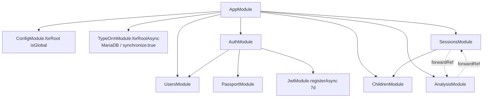
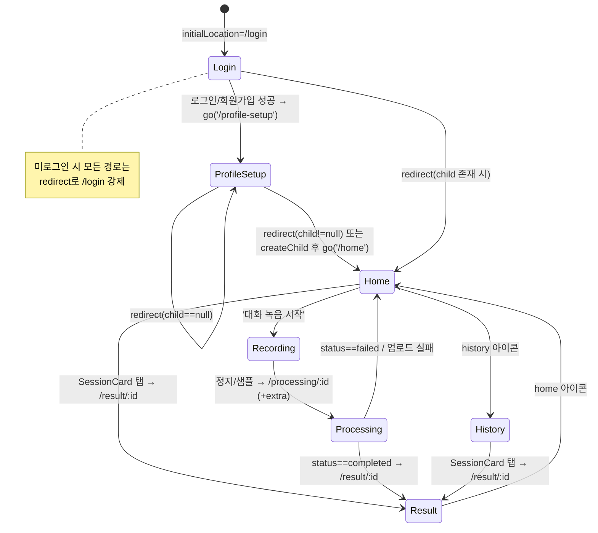
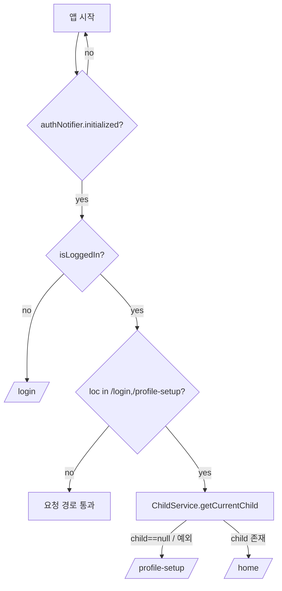

# 아이 훈육 코칭 앱 — LLD (Low-Level Design, 상세 설계)

**버전:** 1.0
**작성일:** 2026-05-30
**상태:** 초안
**관련 문서:** [HLD.md](./HLD.md)

---

## 개요

본 문서는 "아이 훈육 코칭 앱"의 상세 설계서다. 실제 구현 코드(`backend/src/**`, `pretty_four/lib/**`)를 1:1로 반영하며, 클래스/메서드 시그니처·DB 스키마·API 명세·JSON 키는 코드와 정확히 일치한다.

- **Part 1 — 백엔드:** NestJS 10 + TypeORM 0.3 + MariaDB 11, OpenAI Whisper / Anthropic Claude 분석 파이프라인
- **Part 2 — 프론트엔드:** Flutter/Dart 클라이언트 (`pretty_four`)

## 목차

**Part 1 — 백엔드**
1. 모듈 구조
2. 데이터 모델 (DB 스키마)
3. API 명세
4. 인증/인가 상세
5. AI 분석 파이프라인 상세
6. 파일 업로드/저장
7. 에러 처리
8. 환경변수
9. 빌드/실행

**Part 2 — 프론트엔드**
1. 앱 구조 개요
2. 초기화 흐름
3. 라우팅
4. 네트워크 계층
5. 인증 상태 관리
6. 서비스 계층
7. 데이터 모델
8. 화면별 상세
9. 위젯
10. 연령 계산

---

# Part 1 — 백엔드

## (백엔드) 상세 설계

> 기준 프레임워크: NestJS 10 + TypeORM 0.3 + MariaDB 11. 모든 시그니처/키/값은 `/backend/src` 실제 코드와 1:1 일치하도록 작성하였다.

### 1. 모듈 구조

`AppModule`은 전역 `ConfigModule`(isGlobal), `TypeOrmModule.forRootAsync`(MariaDB 연결, 4개 엔티티 등록, `synchronize: true`, `charset: 'utf8mb4'`)과 5개 기능 모듈을 import한다.

- `AuthModule` → `UsersModule`, `PassportModule`, `JwtModule.registerAsync`(secret=`JWT_SECRET`, expiresIn=`JWT_EXPIRES_IN`(기본 `7d`))
- `UsersModule` → `User` 엔티티 forFeature, `UsersService` export
- `ChildrenModule` → `Child` 엔티티 forFeature, `ChildrenService` export
- `SessionsModule` ↔ `AnalysisModule` : **순환 의존**. 양쪽 모두 `forwardRef()`로 서로를 import한다. `SessionsModule`은 추가로 `ChildrenModule`을 import.
  - `AnalysisService`는 `@Inject(forwardRef(() => SessionsService))`로 `SessionsService`를 주입받는다.
  - `SessionsController`는 `SessionsService` + `AnalysisService` + `ChildrenService`를 함께 주입받는다.



---

### 2. 데이터 모델 (DB 스키마)

DB는 MariaDB(`type: 'mariadb'`, 드라이버 패키지 `mysql2`), `synchronize: true`로 엔티티 기반 자동 스키마 생성, `charset: utf8mb4`. PK는 모두 `uuid` 자동 생성. 컬럼명은 TypeORM camelCase 그대로 사용.

#### users (`@Entity('users')`)

| 컬럼 | 타입 | 제약 |
|---|---|---|
| id | uuid | PK (`PrimaryGeneratedColumn('uuid')`) |
| email | varchar | unique, nullable |
| password | varchar | nullable, `select: false` (기본 조회 시 제외) |
| provider | enum(`email`,`google`,`kakao`) | default `email` |
| providerId | varchar | nullable |
| createdAt | datetime | `@CreateDateColumn` |

- enum: `AuthProvider { EMAIL='email', GOOGLE='google', KAKAO='kakao' }`
- `password`는 `select:false`라서 `findByEmail`에서 명시적으로 `select: ['id','email','password','provider','createdAt']`로 포함시켜야 비밀번호 비교 가능.

#### children (`@Entity('children')`)

| 컬럼 | 타입 | 제약 |
|---|---|---|
| id | uuid | PK |
| userId | varchar | NOT NULL, FK 대상 컬럼 |
| name | varchar | NOT NULL |
| birthDate | date | NOT NULL (`type: 'date'`, TS 타입은 string) |
| createdAt | datetime | `@CreateDateColumn` |

- 관계: `@ManyToOne(() => User)` + `@JoinColumn({ name: 'userId' })` → `users.id` 참조.

#### sessions (`@Entity('sessions')`)

| 컬럼 | 타입 | 제약 |
|---|---|---|
| id | uuid | PK |
| childId | varchar | NOT NULL, FK 대상 컬럼 |
| userId | varchar | NOT NULL |
| audioPath | varchar | nullable (분석 후 null로 갱신) |
| durationSec | int | default 0 |
| status | enum(`processing`,`completed`,`failed`) | default `processing` |
| recordedAt | datetime | `@CreateDateColumn` |

- enum: `SessionStatus { PROCESSING='processing', COMPLETED='completed', FAILED='failed' }`
- 관계: `@ManyToOne(() => Child)` + `@JoinColumn({ name: 'childId' })` → `children.id` 참조.

#### analysis_results (`@Entity('analysis_results')`)

| 컬럼 | 타입 | 제약 |
|---|---|---|
| id | uuid | PK |
| sessionId | varchar | NOT NULL, FK 대상 컬럼 |
| summary | json | NOT NULL (`type: 'json'`, TS `object`) |
| feedbacks | json | NOT NULL (`type: 'json'`, TS `object`) |
| rawTranscript | text | nullable |
| childAgeMonths | int | NOT NULL |
| createdAt | datetime | `@CreateDateColumn` |

- 관계: `@OneToOne(() => Session)` + `@JoinColumn({ name: 'sessionId' })` → `sessions.id` 참조 (세션 1 : 분석결과 1).

---

### 3. API 명세

전역 prefix 없음(루트 경로). `ValidationPipe({ whitelist: true, transform: true })` 전역 적용. CORS `origin: '*'`. 인증은 `JwtAuthGuard`(`AuthGuard('jwt')`)로 처리하며, `children`/`sessions` 컨트롤러는 클래스 레벨 `@UseGuards(JwtAuthGuard)`로 전 엔드포인트 보호. `auth` 컨트롤러는 비인증.

| 메서드 | 경로 | 인증 | 요청 | 응답 | 상태코드 |
|---|---|---|---|---|---|
| POST | /auth/register | X | body: `{ email(IsEmail), password(IsString, MinLength 6) }` | `{ access_token, user: { id, email } }` | 201(기본) / 409(이메일 중복) |
| POST | /auth/login | X | body: `{ email(IsEmail), password(IsString) }` | `{ access_token, user: { id, email } }` | 200(`@HttpCode(200)`) / 401 |
| POST | /auth/google/token | X | body: `{ idToken(IsString) }` | `{ access_token, user: { id, email } }` | 200 / 401 |
| POST | /auth/kakao | X | body: `{ kakaoAccessToken(IsString) }` | `{ access_token, user: { id, email } }` | 200 / 401 |
| GET | /children/current | O | - | `Child | null` (해당 유저의 가장 오래된 1건, createdAt ASC) | 200 |
| POST | /children | O | body: `{ name(IsString), birthDate(IsDateString) }` | 생성된 `Child` | 201 |
| PATCH | /children/:id | O | param: `id`, body: `{ name?, birthDate? }` (CreateChildDto) | 수정된 `Child` | 200 / 404(없음) / 403(소유자 불일치) |
| GET | /sessions | O | query: `limit?`(기본 20) | `Session[]` (status=completed, recordedAt DESC, take limit) | 200 |
| POST | /sessions/upload | O | multipart: `audio`(파일), body: `childId`, `durationSec` | `{ session_id }` | 201 / 400(파일 없음·childId 없음·아이프로필 없음) |
| GET | /sessions/:id | O | param: `id` | `Session` | 200 / 404(없음) / 403(소유자 불일치) |
| GET | /sessions/:id/result | O | param: `id` | `AnalysisResult` | 200 / 404(세션 없음 또는 분석 결과 미생성) / 403 |

비고:
- `register`는 `@HttpCode` 미지정이므로 NestJS POST 기본값 201. `login`/`google/token`/`kakao`는 `@HttpCode(200)` 명시.
- `POST /children`도 `@HttpCode` 미지정 → 201.
- `GET /sessions`는 **completed 상태만** 반환(`findRecent`에서 `status: COMPLETED` 필터). processing/failed는 목록에서 제외됨.
- `GET /sessions/:id/result`는 먼저 `findById`로 세션 소유권을 검증(없으면 404/403)한 뒤, 분석 결과가 없으면 404(`'분석 결과가 아직 없습니다.'`).
- `req.user`는 JwtStrategy.validate가 반환한 `User` 엔티티 전체이며 컨트롤러는 `req.user.id`를 사용.

---

### 4. 인증/인가 상세

**JWT 발급** (`AuthService.sign`)
- payload: `{ sub: userId }` 만 포함.
- 서명: `JwtService.sign({ sub })`, secret=`JWT_SECRET`, expiresIn=`JWT_EXPIRES_IN`(기본 `7d`).
- 모든 인증 성공 응답은 `{ access_token, user: { id, email } }` 형태.

**JwtStrategy 검증 흐름** (`strategies/jwt.strategy.ts`)
1. `ExtractJwt.fromAuthHeaderAsBearerToken()`로 `Authorization: Bearer <token>` 헤더에서 토큰 추출.
2. `secretOrKey: JWT_SECRET`으로 서명 검증.
3. `validate(payload: { sub: string })`에서 `usersService.findById(payload.sub)` 조회.
4. 유저 없으면 `UnauthorizedException`(401), 있으면 `User` 객체 반환 → `req.user`에 주입.

**JwtAuthGuard** (`guards/jwt-auth.guard.ts`): `AuthGuard('jwt')` 상속만 한 단순 가드. children/sessions 컨트롤러에 클래스 레벨로 적용.

**이메일 가입/로그인 (bcrypt)**
- 가입: `findByEmail`로 중복 확인 → 있으면 `ConflictException`(409, `'이미 사용 중인 이메일입니다.'`). 없으면 `bcrypt.hash(password, 10)`(salt rounds 10)으로 해싱 후 `provider: EMAIL`로 생성.
- 로그인: `findByEmail`(password 포함 select) → 유저 없거나 password 없으면 401. `bcrypt.compare(plain, hash)` 실패 시 401(`'이메일 또는 비밀번호가 올바르지 않습니다.'`).

**구글 로그인** (`loginWithGoogle`)
- 생성자에서 `new OAuth2Client(GOOGLE_CLIENT_ID)` 초기화 (google-auth-library).
- `googleClient.verifyIdToken({ idToken, audience: GOOGLE_CLIENT_ID })` → 실패 시 401(`'유효하지 않은 Google 토큰입니다.'`).
- payload에서 `{ sub: googleId, email }` 추출 → `findBySocialId(GOOGLE, googleId)`.
- 없으면 `create({ email, provider: GOOGLE, providerId: googleId })`.

**카카오 로그인** (`loginWithKakao`)
- `axios.get('https://kapi.kakao.com/v2/user/me', { headers: { Authorization: 'Bearer <kakaoAccessToken>' } })` → 실패 시 401(`'유효하지 않은 카카오 토큰입니다.'`).
- `kakaoId = String(res.data.id)`, `email = res.data.kakao_account?.email`(없을 수 있음).
- `findBySocialId(KAKAO, kakaoId)` → 없으면 `create({ email: email ?? null, provider: KAKAO, providerId: kakaoId })`.

소셜 로그인 공통 패턴: **findBySocialId(provider, providerId) → 없으면 create → 항상 sign 후 토큰 발급.**

---

### 5. AI 분석 파이프라인 상세

`AnalysisService.runAnalysis(sessionId, audioPath, childAgeMonths)`는 업로드 컨트롤러에서 `await` 없이 fire-and-forget(`.catch(() => {})`)으로 호출되어 백그라운드 비동기 처리된다. 세션은 생성 시 `processing` 상태.

**runAnalysis 단계**
1. `transcript = await transcribe(audioPath)` — Whisper 전사.
2. `result = await analyze(transcript, childAgeMonths)` — Claude 코칭 분석.
3. `repo.save(repo.create({ sessionId, summary: result.summary, feedbacks: result.feedbacks, rawTranscript: transcript, childAgeMonths }))` — 결과 저장.
4. `sessions.updateStatus(sessionId, COMPLETED)`.
5. catch: 실패 시 로깅 후 `sessions.updateStatus(sessionId, FAILED)`.
6. finally: `fs.unlinkSync(audioPath)`(실패 무시) + `sessions.clearAudioPath(sessionId)`(audioPath를 null로) — 성공/실패 무관하게 항상 오디오 파일 삭제 및 경로 정리.

**transcribe() — OpenAI Whisper**
- `form-data` 구성:
  - `file`: `fs.createReadStream(audioPath)`, `{ filename: 'audio.m4a', contentType: 'audio/m4a' }`
  - `model`: `whisper-1`
  - `response_format`: `verbose_json`
  - `timestamp_granularities[]`: `segment`
- `axios.post('https://api.openai.com/v1/audio/transcriptions', form, { headers: { ...form.getHeaders(), Authorization: 'Bearer <OPENAI_API_KEY>' } })`.
- 응답 `res.data.segments`를 `[${Math.floor(s.start)}s] ${s.text}` 형태로 줄바꿈 join. 세그먼트가 없으면 `res.data.text` fallback.

**analyze() — Anthropic Claude**
- 클라이언트: `new Anthropic({ apiKey: ANTHROPIC_API_KEY })`.
- `getAgeContext(ageMonths)`로 연령별 코칭 컨텍스트 선택 (4구간):
  - `< 48개월` → `infant`: 만 2~3세, 단순·일관된 짧은 지시, 감정 이름 붙이기.
  - `< 84개월` → `preschool`: 만 4~6세, 선택지 제공·규칙 이유 설명·긍정 강화.
  - `< 132개월` → `school`: 만 7~10세, 논리적 설명·감정 공감·질문 유도.
  - `132개월 이상` → `preteen`: 만 11세 이상, 자율성 존중·협상/타협.
- `anthropic.messages.create({ model: 'claude-sonnet-4-6', max_tokens: 2048, messages: [{ role:'user', content: <연령컨텍스트+전사본+JSON 스키마 지시 프롬프트> }] })`.
- 응답 파싱: `message.content[0].text.trim()` → 코드펜스 제거(`/^```(?:json)?\n?/` 및 `/\n?```$/` 치환) → `JSON.parse`. 파싱 실패 시 `Error('Claude 응답 JSON 파싱 실패')`.
- 검증: `parsed.summary` 존재 + `Array.isArray(parsed.feedbacks)` 아니면 `Error('Claude 응답 형식 오류')`. 통과 시 `{ summary, feedbacks }` 반환.
- 기대 JSON 구조: `summary { tone, patterns[], improvements[] }`, `feedbacks[] { timestamp_sec, original, suggestion, reason }`.

**연령(개월) 계산** — `sessions.controller.ts`의 `upload`에 위치:
```
const birthDate = new Date(child.birthDate);
const now = new Date();
const ageMonths = (now.getFullYear() - birthDate.getFullYear()) * 12 + (now.getMonth() - birthDate.getMonth());
```
- 대상 아이는 `children.findCurrent(req.user.id)`로 조회한 **현재 아이**(가장 오래된 1건). `childId` body 값과 별개로 현재 아이 기준 연령을 계산하는 점에 유의.

---

### 6. 파일 업로드/저장

`POST /sessions/upload`의 `FileInterceptor('audio', ...)` 설정:
- `multer.diskStorage`:
  - `destination`: `process.env.UPLOAD_DIR ?? '/app/uploads'`
  - `filename`: `${uuidv4()}.m4a` (uuid v4 + 고정 확장자 `.m4a`)
- `limits.fileSize`: `30 * 1024 * 1024` (30MB)
- 저장된 파일 경로(`file.path`)는 세션 생성 시 `audioPath`로 저장됨.
- Docker: `audio_tmp` named volume이 `/app/uploads`에 마운트되어 임시 오디오 저장. 분석 완료(또는 실패) 후 `unlinkSync`로 파일 삭제 + `audioPath` null 처리되므로 디스크에 영구 보존하지 않음.
- Dockerfile 런타임 스테이지에서 `mkdir -p /app/uploads`로 디렉터리 보장.

---

### 7. 에러 처리

- **전역 ValidationPipe** (`main.ts`): `whitelist: true`(DTO 미정의 속성 제거), `transform: true`(타입 변환). DTO 검증 실패 시 400 Bad Request.
- **401 Unauthorized**: 로그인 자격 오류, 소셜 토큰 검증 실패, JwtStrategy.validate에서 유저 없음.
- **409 Conflict**: 이메일 중복 가입.
- **403 Forbidden**: child/session 소유자(userId) 불일치(`ChildrenService.update`, `SessionsService.findById`).
- **404 NotFound**: child 없음(update), session 없음(findById), 분석 결과 미생성(`/sessions/:id/result`).
- **400 Bad Request**: 업로드 시 파일 없음 / childId 없음 / 아이 프로필 없음.
- **분석 실패**: `runAnalysis` 예외 시 catch에서 세션 `status=failed`로 갱신. 호출부가 `.catch(() => {})`로 무시하므로 업로드 응답(`{ session_id }`)에는 영향 없음. 클라이언트는 이후 폴링으로 상태 확인.

---

### 8. 환경변수

`.env.example` 기준.

| 키 | 용도 |
|---|---|
| DB_NAME | DB 데이터베이스명 (TypeOrm `database`) |
| DB_USER | DB 사용자 (TypeOrm `username`) |
| DB_PASSWORD | DB 비밀번호 |
| DB_ROOT_PASSWORD | MariaDB 컨테이너 root 비밀번호 (docker-compose) |
| DB_HOST | DB 호스트 (코드 기본값 `localhost`, compose에서 `db`) |
| DB_PORT | DB 포트 (코드 기본값 `3306`) |
| JWT_SECRET | JWT 서명 비밀키 |
| JWT_EXPIRES_IN | JWT 만료 (기본 `7d`) |
| OPENAI_API_KEY | Whisper 전사 API 인증 |
| ANTHROPIC_API_KEY | Claude 분석 API 인증 |
| GOOGLE_CLIENT_ID | 구글 idToken 검증 audience/clientId |
| GOOGLE_CLIENT_SECRET | (env에 정의, 현 코드에서 직접 사용 안 함) |
| KAKAO_REST_API_KEY | (env에 정의, 현 코드에서 직접 사용 안 함 — 카카오는 클라이언트 accessToken 검증 방식) |
| APP_URL | 앱 베이스 URL (env에 정의) |
| UPLOAD_DIR | 업로드 디렉터리 (코드 기본값 `/app/uploads`, env 예시 `./uploads`) |
| PORT | 서버 포트 (코드 기본값 `3000`, env에는 미정의) |

비고: `DB_HOST`/`DB_PORT`/`PORT`는 `.env.example`에 없으나 코드/compose에서 사용된다(코드 기본값 또는 compose `environment`로 주입).

---

### 9. 빌드/실행

**Dockerfile (멀티스테이지)**
- builder: `node:20-alpine`, `npm ci`(devDeps 포함) → 소스 복사 → `npm run build`(`nest build` → `dist`).
- 런타임: `node:20-alpine`, `npm ci --omit=dev`(프로덕션 의존성만) → builder의 `/app/dist` 복사 → `mkdir -p /app/uploads` → `EXPOSE 3000` → `CMD ["node", "dist/main"]`.

**tsconfig.json 주요 옵션**
- `module: commonjs`, `target: ES2021`, `outDir: ./dist`
- `emitDecoratorMetadata: true`, `experimentalDecorators: true` (NestJS/TypeORM 데코레이터 필수)
- `esModuleInterop: true`, `allowSyntheticDefaultImports: true` (axios/form-data 등 default import)
- `declaration: true`, `removeComments: true`, `sourceMap: true`, `incremental: true`, `skipLibCheck: true`
- 느슨한 검사: `strictNullChecks: false`, `noImplicitAny: false`, `strictBindCallApply: false`, `forceConsistentCasingInFileNames: false`, `noFallthroughCasesInSwitch: false`

**npm scripts** (package.json)
- `build`: `nest build`
- `start`: `node dist/main`
- `start:dev`: `nest start --watch`

**주요 런타임 의존성**: `@nestjs/* 10`, `typeorm 0.3.20`, `mysql2 3.9`(MariaDB 드라이버), `passport`/`passport-jwt`, `bcrypt`, `class-validator`/`class-transformer`, `multer`, `axios`, `form-data`, `google-auth-library 9.7`, `uuid 9`, `@anthropic-ai/sdk 0.24`.

**docker-compose**: `db`(mariadb:11, healthcheck, db_data 볼륨, 3306 노출) + `backend`(./backend 빌드, db healthy 의존, `.env` 로드 + `DB_HOST=db`/`DB_PORT=3306` 주입, 3000 노출, `audio_tmp:/app/uploads` 볼륨).


---

# Part 2 — 프론트엔드

> 대상: Flutter/Dart 클라이언트 (`pretty_four`). 본 문서는 실제 소스 코드(`lib/**`, `pubspec.yaml`)를 1:1로 옮긴 상세 설계이며, 클래스/메서드 시그니처와 JSON 키는 코드와 정확히 일치한다.

---

## 1. 앱 구조 개요

### 1.1 디렉터리 트리

```
lib/
├── main.dart                       # 부트스트랩(초기화 순서)
├── app.dart                        # App 위젯(MaterialApp.router + ProviderScope)
├── core/                           # 횡단 인프라
│   ├── router.dart                 # go_router 라우트/리다이렉트
│   ├── api_client.dart             # Dio 싱글턴 + 인터셉터
│   ├── auth_notifier.dart          # 인증 상태(ChangeNotifier) + secure storage
│   ├── api_error.dart              # DioException → 한국어 메시지
│   └── age_calculator.dart         # 개월 수/코칭 컨텍스트 계산 유틸
├── services/                       # 엔드포인트 호출 계층
│   ├── auth_service.dart           # 로그인/회원가입/소셜/로그아웃
│   ├── child_service.dart          # 아이 프로필 조회/생성
│   ├── session_service.dart        # 세션 목록 조회
│   ├── analysis_service.dart       # 업로드/폴링/결과 조회
│   └── recording_service.dart      # 마이크 녹음(record 패키지)
├── models/                         # 직렬화 모델(fromJson/toJson)
│   ├── child.dart
│   ├── session.dart
│   ├── analysis_result.dart
│   ├── feedback_item.dart
│   └── conversation_summary.dart
├── screens/                        # 화면(StatefulWidget 위주)
│   ├── auth/login_screen.dart
│   ├── auth/profile_setup_screen.dart
│   ├── home/home_screen.dart
│   ├── recording/recording_screen.dart
│   ├── processing/processing_screen.dart
│   ├── result/result_screen.dart
│   └── history/history_screen.dart
└── widgets/                        # 재사용 프레젠테이션 위젯
    ├── waveform_widget.dart
    ├── summary_card.dart
    ├── feedback_list_item.dart
    └── session_card.dart
```

### 1.2 레이어 책임

| 레이어 | 책임 | 비고 |
|---|---|---|
| `core` | 앱 전역 인프라: 라우팅, HTTP 클라이언트, 인증 상태, 에러 변환, 연령 계산 | 화면/비즈니스 로직에 의존하지 않음 |
| `services` | 백엔드 엔드포인트 호출과 모델 직렬화. `ApiClient.instance`(Dio)를 통해 통신 | 상태를 보유하지 않음(단, `AuthService`는 `AuthNotifier` 주입, `RecordingService`는 녹음기 상태 보유) |
| `models` | 데이터 전송 객체(DTO). `fromJson`/`toJson` 제공, 불변(`final` 필드) | 키 규칙은 7장 참조 |
| `screens` | 화면 단위 UI 및 상태(`State`). 서비스 호출, 네비게이션(`context.go`), 스낵바 처리 | 대부분 `StatefulWidget` |
| `widgets` | 순수 프레젠테이션 위젯(파형, 카드, 피드백 항목). 모두 `StatelessWidget` | 비즈니스 로직 없음 |

### 1.3 주요 의존성(pubspec.yaml)

| 패키지 | 버전 | 용도 |
|---|---|---|
| `dio` | ^5.4.0 | HTTP 클라이언트 |
| `flutter_secure_storage` | ^9.2.2 | access_token 보관 |
| `google_sign_in` | ^6.2.1 | 구글 로그인 |
| `kakao_flutter_sdk_user` | ^1.9.5 | 카카오 로그인 |
| `go_router` | ^13.2.0 | 선언적 라우팅 |
| `flutter_riverpod` | ^2.5.1 / `riverpod_annotation` ^2.3.5 | `ProviderScope`로 앱 래핑(현재 코드에서 Provider 실사용은 없음) |
| `record` | ^6.2.1 | 오디오 녹음 |
| `permission_handler` | ^11.3.1 | 마이크 권한 |
| `path_provider` | ^2.1.3 | 임시 디렉터리 경로 |
| `intl` | ^0.19.0 | 날짜 포맷 |
| `flutter_dotenv` | ^5.1.0 | `.env` 로드 |
| `uuid` | ^4.4.0 | 세션 ID(v4) 생성 |

> `flutter` 자산: `.env`, `assets/sample.m4a`(디버그용 샘플 분석에 사용).

---

## 2. 초기화 흐름 (main.dart)

`main()`은 `async`이며 다음 순서로 동작한다(코드 순서 그대로).

```dart
Future<void> main() async {
  WidgetsFlutterBinding.ensureInitialized();
  await dotenv.load();
  KakaoSdk.init(nativeAppKey: dotenv.env['KAKAO_NATIVE_APP_KEY']!);
  await authNotifier.init();
  ApiClient.init(dotenv.env['API_BASE_URL']!, authNotifier);
  runApp(const App());
}
```

1. **`WidgetsFlutterBinding.ensureInitialized()`** — 플러그인 채널 사용 전 바인딩 초기화.
2. **`await dotenv.load()`** — `.env` 파일 로드(자산으로 번들됨).
3. **`KakaoSdk.init(nativeAppKey: dotenv.env['KAKAO_NATIVE_APP_KEY']!)`** — 카카오 SDK 초기화. 키는 `.env`에서 읽고 `!`로 강제 언랩(미설정 시 즉시 예외).
4. **`await authNotifier.init()`** — secure storage에서 `access_token` 복원하고 `_initialized = true` 설정 후 `notifyListeners()`. (5장 참조)
5. **`ApiClient.init(dotenv.env['API_BASE_URL']!, authNotifier)`** — Dio 인스턴스 생성 및 인터셉터 등록. baseUrl은 `.env`의 `API_BASE_URL`. `authNotifier`를 주입해 토큰 자동 첨부/401 처리. (4장 참조)
6. **`runApp(const App())`** — `App` 위젯 구동.

`App`(app.dart)은 `ProviderScope`(riverpod)로 `MaterialApp.router`를 감싼다.
- `title: '육아 코칭'`
- `theme`: `ColorScheme.fromSeed(seedColor: Color(0xFF6B9DFC))`, `useMaterial3: true`
- `routerConfig: router` (core/router.dart의 전역 `router`)

> 주의: `authNotifier.init()`이 `ApiClient.init()`보다 먼저 호출되므로, 첫 요청 시점에 토큰 복원이 보장된다.

---

## 3. 라우팅 (core/router.dart)

`go_router` 전역 인스턴스 `router`. `initialLocation: '/login'`, `refreshListenable: authNotifier`(인증 상태 변경 시 라우터 재평가).

### 3.1 라우트 표 (7개)

| 경로 | 화면 | 파라미터 | 비고 |
|---|---|---|---|
| `/login` | `LoginScreen` | 없음 | 초기 위치 |
| `/profile-setup` | `ProfileSetupScreen` | 없음 | 아이 정보 입력 |
| `/home` | `HomeScreen` | 없음 | 메인 |
| `/recording` | `RecordingScreen` | 없음 | 녹음 |
| `/processing/:sessionId` | `ProcessingScreen(sessionId)` | path: `sessionId`; extra: `{audioPath, durationSec}` | 업로드/폴링 |
| `/result/:sessionId` | `ResultScreen(sessionId)` | path: `sessionId` | 결과 |
| `/history` | `HistoryScreen` | 없음 | 전체 기록 |

> `:sessionId`는 `state.pathParameters['sessionId']!`로 추출하여 생성자에 전달. `/processing`은 추가로 `state.extra`(Map)로 `audioPath`, `durationSec`을 받는다(8장 참조).

### 3.2 redirect 로직 (async)

```dart
redirect: (context, state) async {
  if (!authNotifier.initialized) return null;          // ① 초기화 전: 리다이렉트 보류
  final isLoggedIn = authNotifier.isLoggedIn;
  final loc = state.matchedLocation;

  if (!isLoggedIn) {                                    // ② 미로그인
    return loc == '/login' ? null : '/login';
  }

  if (loc == '/login' || loc == '/profile-setup') {    // ③ 로그인 + 진입 화면
    try {
      final child = await ChildService().getCurrentChild();
      if (child == null) return loc == '/profile-setup' ? null : '/profile-setup';
      return '/home';
    } catch (_) {
      return loc == '/profile-setup' ? null : '/profile-setup';
    }
  }
  return null;                                          // ④ 그 외: 통과
}
```

- **① 초기화 가드**: `authNotifier.initialized`가 false이면 `null` 반환(리다이렉트 안 함). secure storage 복원 완료 전 깜빡임 방지.
- **② 미로그인**: `isLoggedIn == false`면 `/login`이 아닌 모든 경로를 `/login`으로.
- **③ 로그인 상태에서 `/login` 또는 `/profile-setup` 진입**: `ChildService().getCurrentChild()`를 호출해 아이 프로필 존재 여부 확인.
  - `child == null` → 현재 `/profile-setup`이면 그대로(`null`), 아니면 `/profile-setup`.
  - 프로필 존재 → `/home`.
  - 예외 발생 → `/profile-setup`(현재 `/profile-setup`이면 그대로).
- **④** 그 외 인증된 경로(`/home`, `/recording`, `/processing`, `/result`, `/history`)는 통과.

> 로그인 화면들은 인증 성공 후 `context.go('/profile-setup')`로 이동하는데(8.1), 프로필이 이미 있으면 redirect ③에 의해 곧바로 `/home`으로 재라우팅된다.

### 3.3 화면 전환 다이어그램





---

## 4. 네트워크 계층 (core/api_client.dart, core/api_error.dart)

### 4.1 ApiClient (Dio 싱글턴)

```dart
class ApiClient {
  static late final Dio _dio;
  static late final AuthNotifier _auth;
  static void init(String baseUrl, AuthNotifier auth) { ... }
  static Dio get instance => _dio;
}
```

- `init(String baseUrl, AuthNotifier auth)`에서 `Dio(BaseOptions(...))` 생성.
  - `baseUrl`: `.env`의 `API_BASE_URL`.
  - `connectTimeout: 30초`, `receiveTimeout: 60초`.
- `instance` 게터로 전역 Dio 접근(모든 서비스가 사용).

### 4.2 인터셉터 (InterceptorsWrapper)

- **onRequest** — `_auth.token`이 `null`이 아니면 `options.headers['Authorization'] = 'Bearer $token'` 자동 첨부 후 `handler.next(options)`.
- **onError** — `error.response?.statusCode == 401`이면 `await _auth.clearToken()` 호출(토큰 삭제 → `notifyListeners` → 라우터가 `/login`으로 재라우팅). 이후 `handler.next(error)`로 오류 전파(자동 재시도 없음).

### 4.3 에러 변환 (apiErrorMessage)

```dart
String apiErrorMessage(Object error)
```

- `DioException`인 경우:
  1. `error.response?.data`가 `Map`이고 `data['message']`가 있으면:
     - `message`가 `List`면 `msg.join('\n')`, 아니면 `msg.toString()` 반환(백엔드 메시지 우선).
  2. 메시지가 없으면 `error.type`별 한국어 메시지:
     - `connectionTimeout` / `receiveTimeout` / `sendTimeout` → "서버 응답이 지연되고 있어요. 잠시 후 다시 시도해주세요."
     - `connectionError` → "서버에 연결할 수 없어요. 네트워크를 확인해주세요."
     - 그 외 → "요청 처리 중 오류가 발생했어요."
- `DioException`이 아니면 `error.toString()`.

> 사용처: `LoginScreen`의 4개 로그인 핸들러는 `apiErrorMessage(e)`로 메시지를 가공한다. 반면 `ProfileSetupScreen`, `ProcessingScreen`, `ResultScreen`은 `e.toString()`을 직접 사용(가공 없음).

---

## 5. 인증 상태 관리 (core/auth_notifier.dart)

전역 인스턴스: `final authNotifier = AuthNotifier();`

```dart
class AuthNotifier extends ChangeNotifier {
  static const _key = 'access_token';
  final _storage = const FlutterSecureStorage();
  String? _token;
  bool _initialized = false;

  bool get isLoggedIn => _token != null;
  String? get token => _token;
  bool get initialized => _initialized;

  Future<void> init() async { ... }            // storage.read → _initialized=true → notify
  Future<void> setToken(String token) async {} // storage.write → _token=token → notify
  Future<void> clearToken() async {}            // storage.delete → _token=null → notify
}
```

| 멤버 | 역할 |
|---|---|
| `_key = 'access_token'` | secure storage 키 |
| `init()` | `_storage.read(key: _key)`로 토큰 복원, `_initialized = true`, `notifyListeners()` |
| `setToken(token)` | `_storage.write`로 저장, `_token` 갱신, `notifyListeners()` |
| `clearToken()` | `_storage.delete`, `_token = null`, `notifyListeners()` |
| `isLoggedIn` | `_token != null` |
| `token` | 현재 토큰(인터셉터가 사용) |
| `initialized` | 복원 완료 여부(redirect 가드) |

- `ChangeNotifier`이므로 `router.refreshListenable = authNotifier`와 연결되어, 토큰 변경 시 라우터가 즉시 재평가된다.
- 토큰 변경 경로: `setToken`(로그인/회원가입 성공), `clearToken`(로그아웃, 401 인터셉터).

---

## 6. 서비스 계층

### 6.1 AuthService (services/auth_service.dart)

생성자 `AuthService(this._auth)` — `AuthNotifier` 주입(화면에서는 `AuthService(authNotifier)`로 생성).

| 메서드 | 시그니처 | 엔드포인트 | 동작 |
|---|---|---|---|
| 이메일 로그인 | `Future<void> signInWithEmail(String email, String password)` | `POST /auth/login` `{email, password}` | `res.data['access_token']` → `setToken` |
| 이메일 회원가입 | `Future<void> signUpWithEmail(String email, String password)` | `POST /auth/register` `{email, password}` | `res.data['access_token']` → `setToken` |
| 구글 로그인 | `Future<void> signInWithGoogle()` | `POST /auth/google/token` `{idToken}` | `GoogleSignIn().signIn()` → 취소 시 예외; `account.authentication.idToken` 추출(null이면 예외) → 서버로 전송 → `setToken` |
| 카카오 로그인 | `Future<void> signInWithKakao()` | `POST /auth/kakao` `{kakaoAccessToken}` | `isKakaoTalkInstalled()`면 `loginWithKakaoTalk()`, 아니면 `loginWithKakaoAccount()` → `token.accessToken` 서버 전송 → `setToken` |
| 로그아웃 | `Future<void> signOut()` | (서버 호출 없음) | `_auth.clearToken()` |

> 모든 인증 응답의 토큰 키는 `access_token`(snake_case). 요청 본문의 소셜 토큰 키는 `idToken`, `kakaoAccessToken`(camelCase).

### 6.2 ChildService (services/child_service.dart)

| 메서드 | 시그니처 | 엔드포인트 | 동작 |
|---|---|---|---|
| 현재 아이 조회 | `Future<Child?> getCurrentChild()` | `GET /children/current` | `res.data == null`이면 `null`; **예외 발생 시 `catch`로 `null` 반환**(에러를 삼킴) → `Child.fromJson` |
| 아이 생성 | `Future<Child> createChild(String name, DateTime birthDate)` | `POST /children` `{name, birthDate}` | `birthDate`는 `toIso8601String().split('T')[0]`(날짜만 `yyyy-MM-dd`) → `Child.fromJson` |

> `getCurrentChild`가 예외를 `null`로 변환하므로, redirect/home/history는 미인증·네트워크 오류와 "프로필 없음"을 구분하지 못하고 동일하게 처리한다(프로필 미존재로 간주).

### 6.3 SessionService (services/session_service.dart)

| 메서드 | 시그니처 | 엔드포인트 | 동작 |
|---|---|---|---|
| 최근 세션 | `Future<List<Session>> getRecentSessions(String childId, {int limit = 20})` | `GET /sessions?limit={limit}` | 응답 `List`를 `Session.fromJson`으로 매핑 |

> 주의: `childId` 인자를 받지만 **요청에 사용하지 않는다**(쿼리는 `limit`만 전달). 서버는 토큰 기반으로 사용자의 세션을 반환하는 것으로 보인다. Home은 `limit: 5`, History는 `limit: 100`으로 호출.

### 6.4 AnalysisService (services/analysis_service.dart)

| 메서드 | 시그니처 | 엔드포인트 | 동작 |
|---|---|---|---|
| 업로드+분석 트리거 | `Future<String> uploadAndTriggerAnalysis({required String childId, required String audioPath, required int durationSec})` | `POST /sessions/upload` (multipart) | `FormData`: `childId`, `durationSec`(문자열), `audio`(`MultipartFile.fromFile(audioPath, filename: 'recording.m4a')`). 반환 `res.data['session_id']`(snake_case) |
| 세션 폴링 | `Future<Session> pollSession(String sessionId)` | `GET /sessions/{sessionId}` | `Session.fromJson`(`status` 확인용) |
| 결과 조회 | `Future<AnalysisResult?> getResult(String sessionId)` | `GET /sessions/{sessionId}/result` | `AnalysisResult.fromJson`; **예외 시 `null` 반환** |

### 6.5 RecordingService (services/recording_service.dart)

`record` 패키지의 `AudioRecorder` 래퍼. `DateTime? _startTime` 보유.

| 멤버 | 시그니처 | 동작 |
|---|---|---|
| 권한 요청 | `Future<bool> requestPermission()` | `Permission.microphone.request()` → `status.isGranted` |
| 시작 | `Future<String> start(String sessionId)` | `getTemporaryDirectory()` 하위 `'$sessionId.m4a'` 경로에 녹음. `RecordConfig(encoder: AudioEncoder.aacLc, sampleRate: 44100, numChannels: 1)`. `_startTime` 기록, 경로 반환 |
| 정지 | `Future<String?> stop()` | `_recorder.stop()`(파일 경로 반환) |
| 일시정지 | `Future<void> pause()` | `_recorder.pause()` |
| 재개 | `Future<void> resume()` | `_recorder.resume()` |
| 진폭 스트림 | `Stream<Amplitude> get amplitudeStream` | `_recorder.onAmplitudeChanged(Duration(milliseconds: 100))` |
| 경과 초 | `int get elapsedSeconds` | `_startTime` 기준 경과 초(미시작 시 0) |
| 녹음 여부 | `Future<bool> get isRecording` | `_recorder.isRecording()` |
| 해제 | `Future<void> dispose()` | `_recorder.dispose()` |

---

## 7. 데이터 모델

### 7.1 키 매핑 규칙 (중요)

| 모델 | 출처 | 키 컨벤션 | 근거 |
|---|---|---|---|
| `Child`, `Session`, `AnalysisResult` | 백엔드 TypeORM 엔티티 | **camelCase** | `userId`, `childId`, `birthDate`, `recordedAt`, `durationSec`, `sessionId`, `rawTranscript`, `childAgeMonths`, `createdAt` |
| `FeedbackItem` | Claude가 생성한 JSON | **snake_case** | `timestamp_sec` 키 사용(`original`, `suggestion`, `reason`은 단일어) |
| `ConversationSummary` | Claude가 생성한 JSON | snake_case 영향권(단일어 필드뿐) | `tone`, `patterns`, `improvements` — 모두 단일 단어라 표기 충돌 없음 |

> 규칙 요약: **최상위/엔티티 모델은 camelCase로 백엔드 TypeORM과 일치**시키고, **LLM(Claude) 생성 페이로드인 `FeedbackItem`/`ConversationSummary`는 모델이 생성한 JSON 키(snake_case)를 그대로 유지**한다. 특히 `FeedbackItem.timestamp_sec`는 snake_case 그대로 역직렬화한다.

### 7.2 Child (models/child.dart)

| Dart 필드 | 타입 | JSON 키 (fromJson/toJson) |
|---|---|---|
| `id` | `String` | `id` |
| `userId` | `String` | `userId` |
| `name` | `String` | `name` |
| `birthDate` | `DateTime` | `birthDate` (fromJson: `DateTime.parse`; toJson: `toIso8601String().split('T')[0]` → `yyyy-MM-dd`) |
| `createdAt` | `DateTime` | `createdAt` (fromJson: `DateTime.parse`; toJson: `toIso8601String()`) |

### 7.3 Session (models/session.dart)

| Dart 필드 | 타입 | JSON 키 |
|---|---|---|
| `id` | `String` | `id` |
| `childId` | `String` | `childId` |
| `recordedAt` | `DateTime` | `recordedAt` |
| `durationSec` | `int` | `durationSec` |
| `status` | `String` | `status` |

게터: `isCompleted` (`status == 'completed'`), `isFailed` (`'failed'`), `isProcessing` (`'processing'`). 폴링 분기에 사용.

### 7.4 AnalysisResult (models/analysis_result.dart)

| Dart 필드 | 타입 | JSON 키 |
|---|---|---|
| `id` | `String` | `id` |
| `sessionId` | `String` | `sessionId` |
| `summary` | `ConversationSummary` | `summary` (중첩 객체 → `ConversationSummary.fromJson`) |
| `feedbacks` | `List<FeedbackItem>` | `feedbacks` (배열 → `FeedbackItem.fromJson` 매핑) |
| `rawTranscript` | `String?` | `rawTranscript` (nullable) |
| `childAgeMonths` | `int` | `childAgeMonths` |
| `createdAt` | `DateTime` | `createdAt` |

### 7.5 FeedbackItem (models/feedback_item.dart) — snake_case

| Dart 필드 | 타입 | JSON 키 |
|---|---|---|
| `timestampSec` | `int` | **`timestamp_sec`** |
| `original` | `String` | `original` |
| `suggestion` | `String` | `suggestion` |
| `reason` | `String` | `reason` |

### 7.6 ConversationSummary (models/conversation_summary.dart)

| Dart 필드 | 타입 | JSON 키 |
|---|---|---|
| `tone` | `String` | `tone` |
| `patterns` | `List<String>` | `patterns` (`(json['patterns'] as List).cast<String>()`) |
| `improvements` | `List<String>` | `improvements` (동일하게 `cast<String>()`) |

---

## 8. 화면별 상세

### 8.1 LoginScreen (screens/auth/login_screen.dart)

- **역할**: 이메일 로그인/회원가입 + 카카오/구글 소셜 로그인.
- **상태 필드**: `_auth = AuthService(authNotifier)`, `_emailCtrl`, `_pwCtrl`(TextEditingController), `bool _loading`.
- **검증**(`_validateInput`): 이메일/비밀번호 비어있음, `email`에 `@`와 `.` 포함 여부, 비밀번호 6자 이상. 실패 시 스낵바.
- **동작**: `_signInWithEmail`/`_signUpWithEmail`(검증 후), `_signInWithKakao`, `_signInWithGoogle` — 모두 `_loading` 토글, 성공 시 `context.go('/profile-setup')`, 실패 시 `apiErrorMessage(e)` 스낵바.
- **네비게이션**: 성공 → `/profile-setup`(이후 redirect가 프로필 있으면 `/home`으로).
- **dispose**: 컨트롤러 해제.

### 8.2 ProfileSetupScreen (screens/auth/profile_setup_screen.dart)

- **역할**: 아이 이름/생년월일 입력 및 생성.
- **상태 필드**: `_childService = ChildService()`, `_nameCtrl`, `DateTime? _birthDate`, `bool _loading`.
- **동작**: `_pickDate`(showDatePicker, initial=3년 전, first=2010, last=now) → `_birthDate` 설정. `_save`: 이름/생년월일 검증 → `createChild(name, birthDate)` → 성공 시 `context.go('/home')`, 실패 시 `e.toString()` 스낵바.
- **표시**: 생년월일은 `DateFormat('yyyy년 M월 d일')`로 표시.

### 8.3 HomeScreen (screens/home/home_screen.dart)

- **역할**: 메인. 아이 이름 헤더 + 녹음 시작 버튼 + 최근 분석 기록(최대 5건).
- **상태 필드**: `_childService`, `_sessionService`, `Child? _child`, `List<Session> _sessions = []`, `bool _loading = true`.
- **`initState` → `_loadData`**: `getCurrentChild()` → `null`이면 `context.go('/profile-setup')`; 아니면 `getRecentSessions(child.id, limit: 5)` 로드. 예외 시 `_loading=false`만 처리(조용히 실패).
- **UI**: AppBar 제목 `'${child.name}와의 대화'`(없으면 `'육아 코칭'`), history 아이콘 → `/history`. 본문: '대화 녹음 시작' 버튼 → `/recording`. 세션 있으면 `SessionCard` 리스트(탭 시 `/result/{id}`), 없으면 빈 안내.

### 8.4 RecordingScreen (screens/recording/recording_screen.dart)

- **역할**: 마이크 녹음, 파형 표시, 일시정지/재개, 10분 제한, 디버그용 샘플 분석.
- **상태 필드**: `_service = RecordingService()`, `List<double> _amplitudes`, `StreamSubscription? _ampSub`, `Timer? _timer`, `bool _isRecording`, `bool _isPaused`, `int _seconds`, `String? _sessionId`, `String? _audioPath`.
- **`initState`**: `amplitudeStream` 구독. 녹음 중·비일시정지일 때 `amp.current`(dBFS, -160~0)를 `((amp.current + 60)/60).clamp(0.05, 1.0)`로 정규화해 `_amplitudes`에 추가, 최대 60개 유지(초과 시 `removeAt(0)`).
- **`_startRecording`**: `requestPermission()` 실패 시 스낵바 후 반환. `Uuid().v4()`로 `_sessionId` 생성 → `_service.start()` → `_audioPath`. `_maxRecordingSeconds = 600`(10분). 1초 주기 `Timer`로 `_seconds++`, **`_seconds >= 600`이면 자동 `_stopAndAnalyze()`**.
- **`_togglePause`**: `_isPaused`에 따라 `resume()`/`pause()` 후 상태 토글.
- **`_stopAndAnalyze`**: 타이머 취소 → `_service.stop()` → `context.go('/processing/$_sessionId', extra: {'audioPath': _audioPath, 'durationSec': _seconds})`.
- **`_analyzeSample`** (디버그 전용, `kDebugMode`에서만 버튼 노출): `assets/sample.m4a`를 임시 파일로 복사 → 새 `Uuid` 세션 → `/processing/$sessionId` 이동(`extra: {audioPath, durationSec: 25}`).
- **UI**: 타이머 `_formatTime`(MM:SS, 48pt). `_seconds >= 540`(9분)이면 "최대 녹음 시간(10분)에 거의 도달했어요" 경고. `WaveformWidget(amplitudes:)`. 비녹음 시 '녹음 시작'(+kDebugMode '샘플 대화로 분석'), 녹음 중에는 일시정지/계속 + '분석 시작'.
- **dispose**: `_ampSub` 취소, `_timer` 취소, `_service.dispose()`.

### 8.5 ProcessingScreen (screens/processing/processing_screen.dart)

- **역할**: 업로드 → 폴링 → 완료 시 결과 이동.
- **생성자**: `ProcessingScreen({required this.sessionId})`(경로 파라미터).
- **상태 필드**: `_analysisService`, `_childService`, `Timer? _pollTimer`, `int _elapsedSeconds`, `Timer? _clockTimer`, `String _statusMessage`, `bool _uploadStarted`.
- **`initState`**: `_clockTimer`(1초 주기)로 `_elapsedSeconds++`, `(_elapsedSeconds ~/ 8)`로 `_messages`(5단계 안내문) 인덱스 갱신.
- **`didChangeDependencies`**: `_uploadStarted` 가드로 1회만 `_startUploadAndAnalyze()` 실행(context/extra 접근 위해 여기서 시작).
- **`_startUploadAndAnalyze`**: `GoRouterState.of(context).extra`에서 `audioPath`, `durationSec` 추출.
  - `audioPath == null` → 업로드 생략하고 `widget.sessionId`로 바로 폴링.
  - 파일이 존재하지 않으면 스낵바 후 `/home`.
  - 정상: `getCurrentChild()`(null이면 중단) → `uploadAndTriggerAnalysis(childId, audioPath, durationSec)` → 반환된 `sessionId`로 `_startPolling`. 예외 시 "업로드 실패" 스낵바 + `/home`.
- **`_startPolling(sessionId)`**: 지역 변수 `_isPolling` **재진입 가드**. 3초 주기 `Timer`로 `pollSession`:
  - 이미 폴링 중이면 즉시 반환.
  - `session.isCompleted` → 타이머 취소 후 `/result/$sessionId`.
  - `session.isFailed` → 타이머 취소, "분석에 실패했어요..." 스낵바 + `/home`.
  - 그 외(processing) → 계속 폴링. `catchError`는 `_isPolling=false` 후 `debugPrint`만(폴링 지속).
- **UI**: 중앙 `CircularProgressIndicator` + `_statusMessage` + "${_elapsedSeconds}초 경과".
- **dispose**: 두 타이머 취소.

### 8.6 ResultScreen (screens/result/result_screen.dart)

- **역할**: `getResult`로 `SummaryCard` + `FeedbackListItem` 렌더.
- **생성자**: `ResultScreen({required this.sessionId})`.
- **상태 필드**: `_service = AnalysisService()`, `AnalysisResult? _result`, `bool _loading = true`, `String? _error`.
- **`initState` → `_loadResult`**: `getResult(sessionId)` → `_result` 설정. 예외 시 `_error = e.toString()`.
- **UI**: AppBar에 home 아이콘(→ `/home`). 로딩/에러/`_result==null`/정상 4분기. 정상(`_buildResult`): `childAgeMonths`를 `~/12`, `%12`로 분해해 "만 N세 M개월" 표시, 분석 일시 `DateFormat('yyyy.MM.dd HH:mm')`(toLocal). `SummaryCard(summary:)`, 피드백 있으면 건수 + `FeedbackListItem` 리스트, 없으면 "특별히 개선할 발화가 없었어요..." 카드.

### 8.7 HistoryScreen (screens/history/history_screen.dart)

- **역할**: 전체 세션 기록(최대 100건) 리스트.
- **상태 필드**: `_childService`, `_sessionService`, `List<Session> _sessions`, `bool _loading`, `String? _error`.
- **`initState` → `_loadSessions`**: `getCurrentChild()` → null이면 로딩 종료(빈 화면). 아니면 `getRecentSessions(child.id, limit: 100)`. 예외 시 `_error` 설정.
- **UI**: 로딩/에러/빈 목록/`ListView.builder`(SessionCard, 탭 시 `/result/{id}`).

---

## 9. 위젯

### 9.1 WaveformWidget (widgets/waveform_widget.dart)

- `StatelessWidget`. 필드: `List<double> amplitudes`, `Color color`(기본 `0xFF6B9DFC`).
- `CustomPaint`로 높이 80, 폭 무한대 영역에 `_WaveformPainter` 렌더.
- `_WaveformPainter`(CustomPainter): paint는 `strokeWidth: 3`, `StrokeCap.round`. `amplitudes.isEmpty`면 즉시 반환. `barWidth = size.width / amplitudes.length`, 각 진폭을 세로 막대(중앙 정렬)로 그림. `shouldRepaint`: `old.amplitudes != amplitudes`.

### 9.2 SummaryCard (widgets/summary_card.dart)

- 필드: `ConversationSummary summary`.
- `Card` 안에 '대화 요약' 헤더(analytics 아이콘) + Divider + `_buildRow('대화 분위기', summary.tone)` + `_buildChipSection('발견된 패턴', summary.patterns, orange.shade100)` + `_buildChipSection('개선 포인트', summary.improvements, green.shade100)`.
- `_buildChipSection`: 라벨 + `Wrap`으로 `Chip` 목록(12pt, `shrinkWrap`).

### 9.3 FeedbackListItem (widgets/feedback_list_item.dart)

- 필드: `FeedbackItem item`.
- `_formatTimestamp(int secs)` → `MM:SS`(`timestampSec` 표시).
- 레이아웃: 타임스탬프(primary 컬러, bold 12pt) → 빨간 박스(`original`, chat 아이콘) → 아래 화살표 → 초록 박스(`suggestion`, lightbulb 아이콘) → 회색 이탤릭 `reason`(12pt).

### 9.4 SessionCard (widgets/session_card.dart)

- 필드: `Session session`, `VoidCallback onTap`.
- `Card` + `ListTile`: leading 마이크 아바타, title `DateFormat('M월 d일 HH:mm')`(recordedAt.toLocal), subtitle `'녹음 시간: ${_formatDuration(durationSec)}'`(분/초), trailing chevron, `onTap`.

---

## 10. 연령 계산 (core/age_calculator.dart)

클라이언트 유틸 `AgeCalculator`가 **존재**한다.

```dart
static int toMonths(DateTime birthDate, [DateTime? now])
static String getCoachingContext(int months)
```

- **`toMonths(birthDate, [now])`**: `(reference.year - birthDate.year) * 12 + (reference.month - birthDate.month)`. `now` 미지정 시 `DateTime.now()`. 일(day)은 고려하지 않는 단순 개월 차이.
- **`getCoachingContext(months)`**: 개월 수 구간별 한국어 코칭 컨텍스트 반환.
  - `< 48`개월: 언어 발달 초기 — 단순/일관 지시, 짧은 문장, 즉각 피드백.
  - `< 84`개월: 규칙 이해·자율성 — 선택지 제공, 규칙 이유 설명.
  - `< 132`개월: 논리적 사고 — 논리적 설명·감정 공감.
  - 그 외: 자율성 중요 — 협상·타협.
  - 각 메시지에 `만 ${months ~/ 12}세` 삽입.

> **사용 현황 / 정합성 메모**: 코칭 컨텍스트 계산은 백엔드에서도 수행하는 것으로 보이며(분석은 서버 측 Claude 호출), 클라이언트의 `AgeCalculator`는 유틸로 존재하나 **현재 읽은 화면/서비스 코드에서 직접 호출되는 지점은 발견되지 않았다**. `ResultScreen`은 서버가 내려준 `AnalysisResult.childAgeMonths`(int)를 그대로 `~/12`, `%12`로 분해해 표시할 뿐, `AgeCalculator`를 사용하지 않는다. 따라서 클라이언트 측 연령/컨텍스트 계산은 (현 시점) 표시·표현용으로 보유된 보조 유틸로 간주한다.
